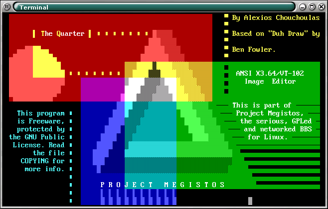
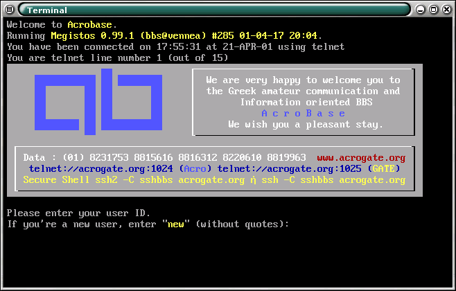
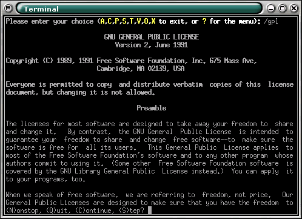
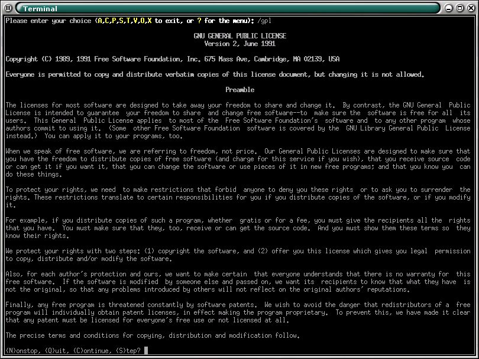
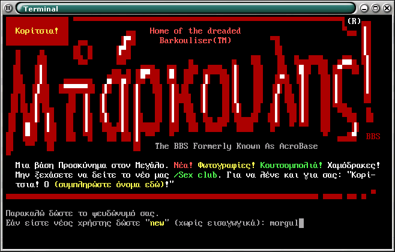

This is Megistos, possibly among the first full-featured old-style BBS packages for Linux (probably among the last, too). The look-and-feel is purposefully nearly identical to that of [The Major BBS](https://en.wikipedia.org/wiki/The_Major_BBS) versions 5 and 6.

```                                 ___
                                #\\\\
                               ###\\\\
                              #####\\\\
                             #######\\\\
                            #### ####\\\\
                           ####   ####\\\\
                          ####   / ####\\\\
                         ####   /   ####\\\\
                        ####   /     ####\\\\
                       ####   /       ####\\\\
                      ####   /         ####\\\\
                     ####   /           ####\\\\
                    ####   /             ####\\\\
                   ####   /               ####\\\\
                  ####   /\\\\\\\\\\\\\\\\\\\\\\\\\
                 ####   /\\\\\\\\\\\\\\\\\\\\\\\\\\\
                 ###                               /
                 ##_______________________________/
                                   
           M  E  G  I  S  T  O  S      P  R  O  J  E  C  T
                                   
```

## Info from the SourceForce Website

Megistos is a large, networked BBS system for Linux and *nix boxen. Its focus is on internationalisation, flexibility, usability and user friendliness.
Megistos is freely available under the terms of the GNU Public License. Source code is our preferred means of disseminating the system.

Please use the menu to navigate, or read on for general information.

### History

Megistos was written for a couple of affiliated BBS systems in Greece, AcroBase and G.A.T.E, currently colocated as the [AcroGATE network](http://www.acrobase.org/megistos.html) (in Greek). Back in the early '90s, both systems ran heavily modified versions of Galacticomm's Major BBS. So heavily modified, in fact, that when version 6 of the software came out, we decided porting all our local software and modifications just wasn't worth it.

It was decided that switching to Linux was a good idea. Many of our users were computer newbies, so the new system's user interface had to resemble the Major BBS as much as possible.

Despite that, we opted for a clean-room implementation, mainly for copyright reasons, but also because it would be pointless to do it otherwise. Even our own software (around 40% of the systems) was rewritten from scratch.

Anyone who's had the discipline-building experience of writing modules and add-ons for the Major BBS will immediately know why (when she recovers from the horrible trance-like flash-back, mumbling things like 'switch... state... substate').

As a useless bit of trivia, when coding started in 1993, there were maybe two or three other BBS packages for Linux, two of which were little more than sets of shell aliases (eek). Early comments in the code identify Megistos as 'Linux BBS', which is dead presumptuous but indicative of the lack of Linux software back then.

### The Game of the Name

This looks like it should be in the FAQ. The name ‘Megistos’ (pronounced MEG-istos, not 'MEJistos' or 'mejISTos') is a combination of inside joke and complex pun with mythological overtones.

The mythology connection: ‘Megistos’ is derived from ‘Hermes Trismegistos’ (latinised as [Hermes Trismegistus](https://en.wikipedia.org/wiki/Hermes_Trismegistus)), a name attributed by the Greeks to the Egyptian god Tehuti (or maybe Djeheuti, we really don't know), or [Thoth](https://en.wikipedia.org/wiki/Thoth), if you like the Greek transliterations of the names of the Egyptian gods. Tehuti was, among other things, god of writing, wisdom and magic. The Greeks likened him to Hermes (aka Mercury if you like the Latin adaptations of the names of the Greek gods), hence ‘Hermes Trismegistos’, or Hermes the Thrice-Great. In later times, Hermes Trismegistos became the patron of alchemists, chemistry hackers of their day as it were. Megistos the BBS began as a hack, hence the name.

The pun: BBS veterans will note that many BBS software of the later years of BBSing had superlative names (to wit: *Maximus* and *Major BBS*). Megistos is just another superlative (it's Greek for 'maximum' or 'greatest'). Of course it's 'thrice great(est)', not just great. Beat *that* superlative if you can!

The inside joke: Megistos is my third attempt at designing BBS software. The first two (unnamed) implementations failed to take off. Disk crashes (those were the days) helped, but I suspect that the choice of operating system (*cough* DOS *cough*) and programming language (Turbo Pascal with ad hoc, homemade multitasking extensions) signed the death warrant of the previous two systems before they ever had a chance.

### Features

Here's a briefly annotated list of major features of Megistos.

* Freeware or Open Source (GPL).
* Small footprint (AcroBase is an AMD K6/233 and it's mostly idle).
* Multi-user.
* Multiple BBSs per host (this hasn'e been tested fully).
* Multiple connection types (serial and networking hardware).
* Multilingual.
* Terminal-type independent.
* Self-documenting (provides help almost everywhere).
* Easy for users to learn (especially if you've used the Major BBS before).
* Includes visual tools (screen editor, dialogue boxes).
* Administrator-friendly (good admin options).
* Unbelievably customisable (like any self-respecting UNIX application).
* Interfaces well with existing software (MUDs etc).
* Supports bots and scripts.
* Extensible with a good API.
* Enough functionality to support a large BBS with many areas.

And here's a list of features scheduled to be added to Megistos 1.1.x, the experimental version (still in the planning stage—note, they never *left* that planning state)

* Full migration to Unicode (will support all character sets used on the planet).
* Perl bindings for the API.
* Full migration to MySQL.
* XML for all configuration settings.
* ICQ gateway (experimental).
* Full operation on the WWW (with Hermes3/Megistos)

### Bugs With (Almost) Seniority

Nothing's perfect. Here's a list of misfeatures, glorious feats of bad design, and other monstrosities. These are in the pipeline. They'll be fixed for the 1.0 stable release of Megistos.
* The source tree is a mess.
* Typhoon DBMS. Bugs-R-Us (in Megistos' ad hoc libraries, not Typhoon itself).
* Only tested on Linux/x86 (may compile on Solaris/sparc though).
* 32-bit specific. Never tried on 64-bit machines.
* A few kludgy, hard-wired Greek-specific features.
* There aren't English versions of all the messages yet.
* All sorts of ugly, reinvent-the-wheel kludgery.

### Screenshots

People seem to judge a lot of books by their covers these days, so we made sure we have a good cover (or several). 😉

Remember, screenshots of Megistos aren't really indicative of much, as the system is very customisable (every BBS needs its own personality).

Let's start with the eye candy. This is The Quarter, Megistos' own ANSI/ASCII art editor (in beta).



The AcroBase login screen on a terminal with the IBM PC extended 'ASCII' (sic).



The exact same screen on a plain US-ASCII terminal. The system translates between encodings automatically.


Showing off the formatter: the GPL rendered on a standard 80x25 terminal.



Showing off the formatter, part two: the GPL at 132 columns. Still looking good!



An elaborate April Fool prank on AcroBase (in Greek, this time). You Are Not Expected To Understand This.

